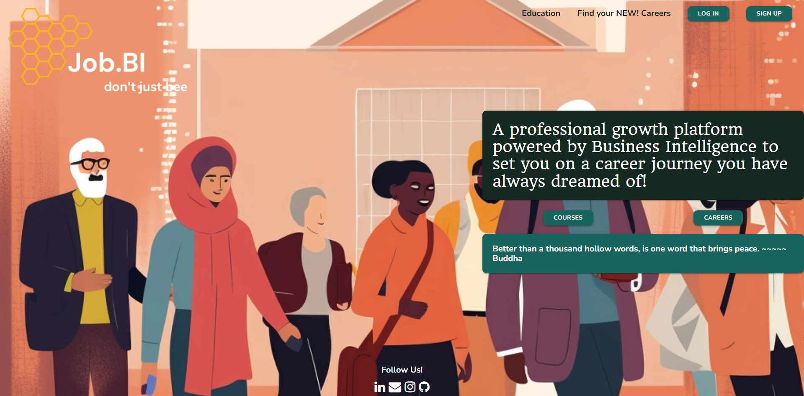
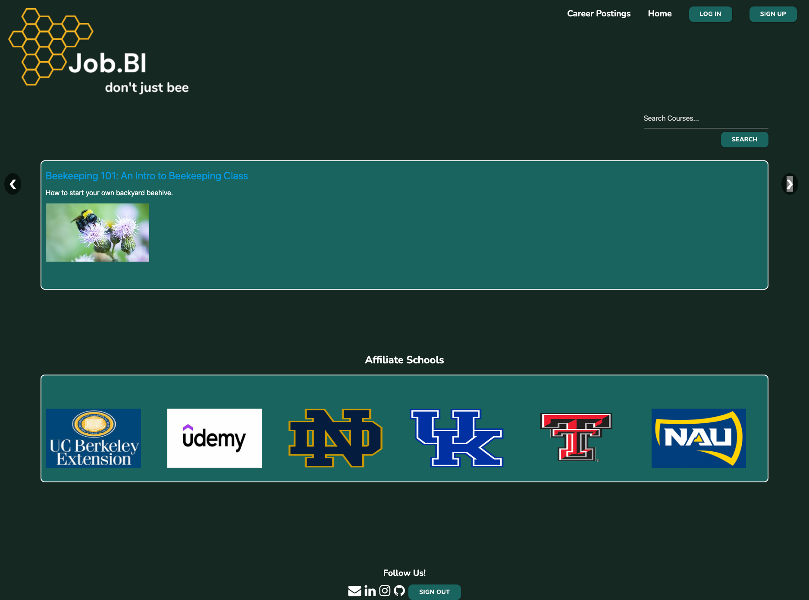
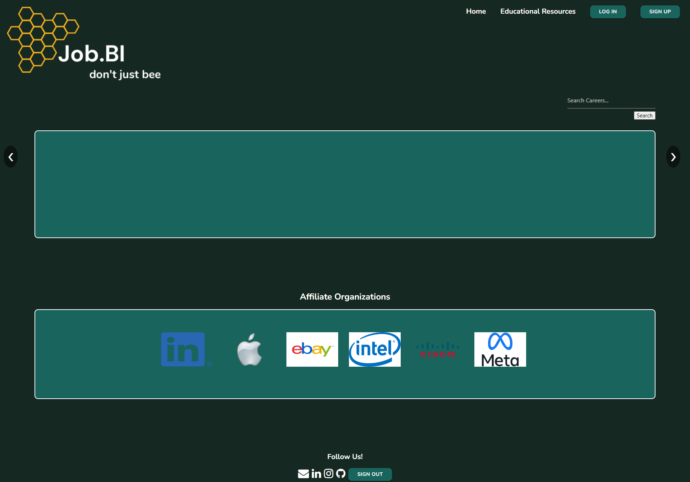

# Job.BI 
## Education and Career Resource Webpage

Job.BI is an education and career resource webpage that provides users with a platform to explore courses and job opportunities. It aims to assist individuals in enhancing their knowledge, skills, and career prospects by offering a curated collection of courses and job postings.

The Job.BI webpage is deployed and accessible at https://markthos.github.io/Job.BI/.

### Table of Contents

- [Description](#description)
- [Technologies Used](#technologies-used)
- [Screenshots](#screenshots)
- [Deployment](#deployment)
- [Usage](#usage)
- [Contributing](#contributing)
- [License](#license)

### Description

Job.BI offers a user-friendly interface with various features and functionalities to help users in their educational and career journeys. The webpage consists of several key pages: Landing Page, Profile Page, Education Page, and Career Page.

### Landing Page

The landing page serves as the entry point to the Job.BI webpage. It provides users with the following options:

- **Sign Up**: Users can create a user profile by entering their username, email, and selecting a password.
- **Log In**: Existing users can log in by providing their username and password.
- **Courses**: Users can access the courses search tool.
- **Careers**: Users can access the job search tool.
- **Education**: Users are redirected to the Courses search page.
- **Find your NEW! Careers**: Users are directed to the Job search page.
- **Inspirational Quote Generator**: Displays a new quote every 15 seconds.

The landing page utilizes JavaScript to fetch inspirational quotes from the [https://type.fit/api/quotes](https://type.fit/api/quotes) API. The quotes are displayed on the page, and a new quote is fetched every 15 seconds.

### Profile Page

Upon completing the sign-up process or logging in, users are redirected to their personal profile page. Here, they can update their profile information, including:

- **Name**: Users can add their name.
- **Interests**: Users can specify their areas of interest.
- **Education**: Users can provide details about their education.
- **Career Goals**: Users can describe their career goals.
- **Profile Picture**: Users have the option to upload a profile picture.

The profile page utilizes JavaScript to retrieve the user object from the query parameters in the URL. The user object is then stored in local storage for future access. The profile page also includes a form that allows users to update their profile information. The updated information is stored in local storage, and the displayed user data is updated accordingly.

### Education Page

The education page allows users to search for courses based on their interests. Users can initiate a search by entering keywords related to their subjects of interest in the "Search Courses" field. The page utilizes the Udemy API to fetch course listings containing the provided keyword and displays them in a carousel container. Users can navigate through the listings using the arrow buttons. The page also features icons of affiliated schools, which users can click on to access their respective landing pages.

### Career Page

The career page enables users to search for job postings based on their desired career paths. Similar to the Education page, users can enter keywords in the "Search Careers" field to initiate a search. The page uses RapidAPI to fetch job listings from LinkedIn containing the provided keyword and displays them in a carousel container. Users can navigate through the listings using the arrow buttons. The page also includes icons of affiliated organizations, which users can click on to access their landing pages.

### Technologies Used

- HTML5
- CSS3
- JavaScript
- Materialize
- Udemy API
- RapidAPI

### Screenshots








### Deployment

The Job.BI webpage is deployed and accessible at [https://markthos.github.io/Job.BI/](https://markthos.github.io/Job.BI/).

### Usage

To run the Job.BI webpage locally, follow these steps:

1. Clone the repository:
   ```bash
   git clone https://github.com/markthos/Job.BI.git
   ```
2. Navigate to the cloned directory:
   ```bash
   cd Job.BI
   ```
3. Open any of the HTML files in a web browser to view the corresponding pages.


### Contributing
Job.BI was created as part of the UC Berkeley Extension Coding Bootcamp curriculum and is based on the requirements in the instructional materials. The site was developed by the Lucky7s, consisting of members:

Monique Merzoug
Mark Thostesen
Vasu Kantesariya
Laetitia Kacoutie-Veh
Oksana Tatsyak
Donahi Casas-Silva


### Acknowledgments

With gratitude to the UC Berkeley Extension Bootcamp Teaching Assistants, Zoom video tutors and AskBCS Learning Assistant tutors for their assistance and expertise throughout the course of the project. Special thanks to project consultant Robbert Wijtman. 

### Web Resources:

- chat.openai.com
- bard.google.com
- Google.com
- w3schools.com
- stackoverflow.com
- docs.rapidapi.com/
- www.udemy.com/developers/affiliate/
- https://type.fit/api/quotes


### License

This project is licensed under the [MIT License](LICENSE).

---

This README.md provides an overview of the Job.BI education and career resource webpage. For more detailed information and access to the source code, please refer to the repository: [https://github.com/markthos/Job.BI](https://github.com/markthos/Job.BI).